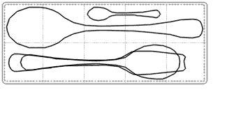
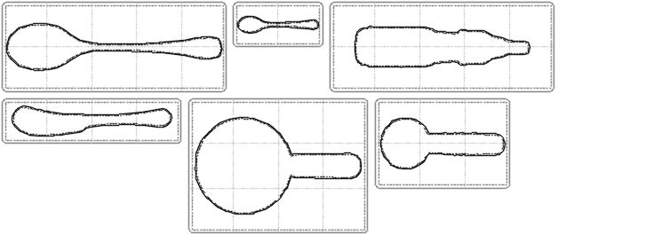
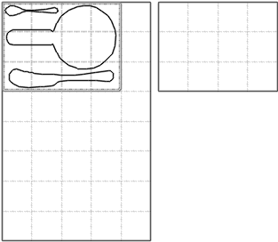

# Gridfinity Contours

Turns photos of oddly-shaped objects into custom-fit
[Gridfinity](https://gridfinity.xyz/) bins: photograph an object next to a
printed calibration sheet, interactively segment it, and extract a
simplified real-world-scale contour.

From there the layout stage takes over: it packs several contours into the
smallest bin that holds them all, decides which objects should share a bin
in the first place, assigns the resulting bins to your drawers, and emits
both the printable `.scad` and true-scale sheets to check against the real
objects. See [Design docs](#design-docs).

## Watching it work

Four utensils looking for the smallest bin that holds them:



It fails at 5x2 and 6x2 before packing into 5x3. A size the solver could
not manage is reported as "not found" rather than "too small": the search
is stochastic, so a tighter packing may still exist.

Six objects deciding which of them should share a bin:



Six bins and 44 cells down to two and 25. The border marks the bins being
priced; most candidates are rejected, so the arrangement only changes on
the few moves worth taking.

Ten objects, grouped into six bins, going into two drawers:



Bins land on whole 42mm cells, and the search takes one back out when a
branch runs out. This is the only level that can prove a set of bins does
not fit.

All three come from `layout_demo.py`, which runs the same code as the CLI.
`make gifs` regenerates all of them (`make -j3 gifs` to run them at once),
or `make gif-pack` / `gif-group` / `gif-drawer` for one:

```
.venv/bin/python3 layout_demo.py pack \
    test_data/small_spoon.svg test_data/medium_spoon.svg test_data/big_spoon.svg \
    test_data/medium_fork.svg --out docs/media/pack.gif \
    --restarts 8 --every 8 --pixels-per-mm 1.4 --colors 8

.venv/bin/python3 layout_demo.py group \
    test_data/big_spoon.svg test_data/small_spoon.svg test_data/screwdriver.svg \
    test_data/spreader.svg test_data/big_measure.svg test_data/small_measure.svg \
    --start one-per-bin --restarts 12 --every 1 \
    --out docs/media/group.gif

.venv/bin/python3 layout_demo.py drawer \
    test_data/small_spoon.svg test_data/medium_spoon.svg test_data/big_spoon.svg \
    test_data/small_fork.svg test_data/medium_fork.svg test_data/big_fork.svg \
    test_data/spreader.svg test_data/screwdriver.svg \
    test_data/small_measure.svg test_data/big_measure.svg \
    --drawer 210x340 --drawer 170x130 --restarts 6 --every 1 \
    --out docs/media/drawer.gif
```

About 15 seconds, 2.5 minutes, and 30 seconds. `--drawer` is a drawer's
interior in millimeters and can be repeated. `--start one-per-bin` gives
the grouping search the most to find; `--start first-fit` is what `Group`
does, and reaches the same 25 cells here.

## Tools

### `silhouette.py` — main app

An interactive PyQt5 GUI that runs the whole capture pipeline:

1. **Load** a photo of the object.
2. **Segment** it by clicking points on the image - left-click adds an
   interior (positive) point, right-click an exterior (negative) point -
   which are fed to a SAM2 model to produce a mask. Only the connected
   component(s) touched by a positive click are kept, so a stray disjoint
   blob elsewhere in the frame doesn't leak into the result.
3. **Clean up** the mask: morphological closing to smooth jitter, a
   minimum-area filter to drop small noise blobs, and optional
   lateral/longitudinal symmetry (many manmade objects are symmetric) -
   combined with the original mask via AND (carve out one-sided errors) or
   OR (fill in an occluded side from its mirror), pivoted on the mask's
   PCA-aligned bounding box.
4. **Extract and simplify** the object's contour, with a PCA-aligned
   bounding box.
5. **Calibrate**: detects ArUco markers on a printed calibration sheet
   (see `generate_aruco_sheet.py` below) and solves for the camera pose to
   recover real-world (mm) coordinates. If no sheet is in frame, contours
   fall back to pixel space instead of failing.
6. **Select** a contour to see it rectified to real-world units
   automatically - a text preview updates live, no button needed.
7. **Export** writes the selected, rectified contour to an SVG file (1
   unit = 1mm, PCA-aligned so it comes out level), ready to import into a
   CAD tool like Fusion 360. Its `width`/`height` are true mm, but the
   viewBox/path coordinates are pre-scaled by 96/25.4 (CSS's 96dpi
   "pixel"), since some importers - Fusion 360 included - ignore the
   physical-unit suffix on `width`/`height` and just assume raw SVG
   coordinates are 96dpi pixels; without that scaling the imported sketch
   comes in ~3.78x too small. A same-scale PDF (`<filename>.svg.pdf`) is
   written alongside it - print that one instead of the SVG directly if a
   printed SVG comes out the wrong size, since not every SVG viewer/print
   path honors its embedded physical units either (a PDF's page size is
   unambiguous).

Each stage's tunable parameters live in its own group box in the control
panel (Segmentation, Calibration, Mask Cleanup, Contour Selection, SVG
Export).

Clicking the image view does one of three things, chosen from the "Click
Mode" dropdown:

- **Add Segmentation Points** (default) - left/right click adds an
  interior/exterior point for SAM2.
- **Select a Contour** - click a detected object to select/deselect it,
  rectifying and previewing it automatically.
- **Select a Fiducial** - click to toggle a calibration fiducial, for
  calibration strategies that support manual selection (not the default
  ArUco one, which auto-matches by marker ID).

Run it with:

```
.venv/bin/python3 silhouette.py [path/to/photo.jpg]
```

The image path is optional; if omitted, use the "Load Image" button.

### `layout_cli.py` — pack contours into a bin

Takes the contours the capture stage exported and finds the smallest
Gridfinity bin they all fit in, writing a true-scale sheet to print and the
`.scad` to slice:

```
.venv/bin/python3 layout_cli.py \
    test_data/small_spoon.svg test_data/medium_spoon.svg test_data/big_spoon.svg \
    --out spoons
```

```
loaded 3 contours from 3 file(s)
...
4x2 (8 cells): too small - part 1 is 162.8x34.9mm and does not fit a 162.3x78.3mm interior at any quarter turn
3x3 (9 cells): too small - part 1 is 162.8x34.9mm and does not fit a 120.3x120.3mm interior at any quarter turn
5x2 (10 cells): packed
packed 3 parts into 5x2 (10 cells)
wrote spoons.svg, spoons.pdf, spoons.scad
```

Every candidate size is reported with why it was rejected, and the two
reasons mean different things. "Too small" is a proof from areas and
bounding boxes, as all nine rejections are here. "Not found" means the
solver did not manage a size the bounds allowed, so that size may still be
packable - raise `--restarts` and see. When that happens below the size it
settles on, a closing note says so, because then the bin you print is
bigger than it needed to be.

Useful flags: `--restarts` and `--seed` steer the search, `--max-grid`
caps the bin size, `--pocket-offset` sets how much larger than its object
each pocket is cut, `--height` sets the bin depth in 7mm Gridfinity units,
and `--no-scad` skips the solid if you only want the sheet. Ctrl-C stops
the search and still reports everything it learned.

It prints a live progress line while it searches, since a hard pack takes
long enough to look hung without one. `--quiet` suppresses it, and it
turns itself off when the output is not a terminal.

### `layout_gui.py` — the same, interactively

```
.venv/bin/python3 layout_gui.py test_data/*.svg
```

A window that accumulates contours from several capture sessions, packs
them, and previews the result. It is separate from `silhouette.py` because
that tool works on one photo, and packing wants objects from many. The
file arguments are optional - there is a Load button.

### `floorplan_gui.py` — the whole library, across your drawers

```
.venv/bin/python3 floorplan_gui.py test_data/*.svg --drawer 500x400
```

The top of the stack. `layout_gui.py` packs the objects you give it into
*a* bin; this one decides which objects should share a bin at all, how
many bins that takes, and which drawer each bin goes in — then draws the
floorplan you print and lay in the drawer.

Drawers are typed in millimeters (what a tape measure reads) and kept in
whole Gridfinity cells (what the search uses). The list shows both,
because the conversion is one-way: a 500mm drawer and a 504mm drawer are
the same eleven cells. `Save...` writes the list as JSON in cells, and
`--drawers FILE` loads one back at launch.

**This search takes minutes, and the window is built around that.** It
runs on a worker thread, redraws the best arrangement it has found four
times a second, and can be stopped — stopping keeps the best grouping it
had, so once the answer stops improving you can take it.

### `field_gui.py` — look at the distance field

```
.venv/bin/python3 field_gui.py test_data/*.svg
```

Both phases of the layout search read one thing — the signed distance
field rasterized for each contour — and neither of them draws it. This
window does: one contour at a time, contoured every millimeter, with the
clearance levels that mean something on a part's own field marked in red
and green. Hover for the distance under the pointer in millimeters.

The **Gradient magnitude** checkbox is the interesting one. It shows where
the field stops being a distance — the creases of the medial axis, which
is exactly where the solver's forces stop being trustworthy. It packs
nothing and writes nothing; it is a magnifying glass, not a stage.

### `generate_aruco_sheet.py`

Generates a letter-size PDF calibration sheet with 4 ArUco markers at known
real-world (mm) positions - print it at 100% scale (no "fit to page") and
keep it in frame when photographing an object, so `silhouette.py` can
recover real-world units automatically. Its defaults already match
`ArucoCalibration`'s expected marker layout, so no configuration is needed
if you don't touch the constants in either file.

```
.venv/bin/python3 generate_aruco_sheet.py [output.pdf]
```

### `solid.py`

The original single-contour bin generator, kept for reference: paste
`silhouette.py`'s export into the `points` array at the bottom and it
writes a Gridfinity `.scad` with one cutout. Requires the
`gridfinity-rebuilt-openscad` submodule (see Installation) and OpenSCAD to
render an STL.

**For anything with more than one object in it, use `layout_cli.py`
instead** - it takes a whole set of contours and writes the `.scad` for
you.

### `layout_demo.py` — animate the search

Writes the GIFs at the top of this file. Commands and flags are up there;
the design behind what they show is in
[docs/architecture.md](docs/architecture.md).

### `postprocess_gcode_for_prusa_i3.py`

A print-time utility: inserts an `M600` color-change pause into
already-sliced gcode at a given layer height, for Prusa i3-family printers.
Useful for making "shadow" prints where the bottom of the cutout is a
different color from the top, for printers without AMS.

```
python3 postprocess_gcode_for_prusa_i3.py path/to/file.gcode [height_mm]
```

## Design docs

- [docs/architecture.md](docs/architecture.md) - the view from above: the
  four cardinality levels (photo, bin, bin set, drawer), where the
  parallelism is, and how the optimization loops nest. Start here.
- [docs/layout.md](docs/layout.md) - packing several contours into the
  smallest practical number of Gridfinity cells, via a repulsive-force
  relaxation, and grouping contours across bins.
  [docs/layout_roadmap.md](docs/layout_roadmap.md) is the implementation
  plan; built through M9.

## Installation

1. Create and activate a virtual environment:
   ```
   python3 -m venv .venv
   source .venv/bin/activate
   ```
2. Install dependencies: `pip install -r requirements.txt`
3. If you'll use `solid.py`, fetch the OpenSCAD submodule it depends on:
   `git submodule update --init`
4. The SAM2 model (`facebook/sam2-hiera-tiny`) is loaded offline
   (`local_files_only=True`) by default, so it needs to already be cached
   locally (e.g. via `huggingface-cli download facebook/sam2-hiera-tiny`)
   before first use. Alternatively, pass `--download-model` to
   `silhouette.py` to let it fetch the model from the Hugging Face Hub on
   first run if it isn't cached yet.

## Development

Config for `black`/`pytest`/`pyright` lives in `pyproject.toml`; `mdformat`
reads only `.mdformat.toml`, not `pyproject.toml`. A `Makefile` wraps all of
them:

- `make format` - apply `black` and `mdformat` formatting
- `make format-check` - check formatting without changing files
- `make lint` - `pyflakes`
- `make typecheck` - `pyright`
- `make test` - `pytest`
- `make check` - all of the above at once, on four cores; every failure is
  reported, not just the first
- `make check-serial` - the same checks one at a time, when interleaved
  output is the problem
- `make docs` - re-render `docs/*.dot` to SVG (needs graphviz);
  `make docs-check` fails if a rendered SVG is older than its source
- `make requirements` - regenerate `requirements.txt` from `requirements.in`
  (see below)

`requirements.in` lists only direct dependencies (runtime + dev tooling);
`requirements.txt` is the fully-pinned, `pip-compile`-generated lockfile
(every transitive dependency, annotated with `# via <package>` showing why
it's there) - install from `requirements.txt`, but edit `requirements.in`
and run `make requirements` to change a direct dependency or its version.
`make requirements` needs `pip-tools` (`pip install pip-tools`); it's a
meta-tool for maintaining the lockfile, not a project dependency itself,
so it isn't in `requirements.in`.

Tests are plain `pytest`. The `slow` marker flags end-to-end work that
costs seconds to minutes - loading the real SAM2 weights, or running the
layout search over real contours:

```
.venv/bin/python3 -m pytest              # everything
.venv/bin/python3 -m pytest -m "not slow"  # skip the slow ones
```
