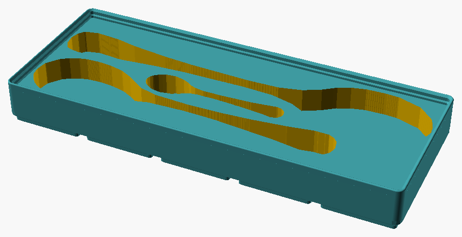
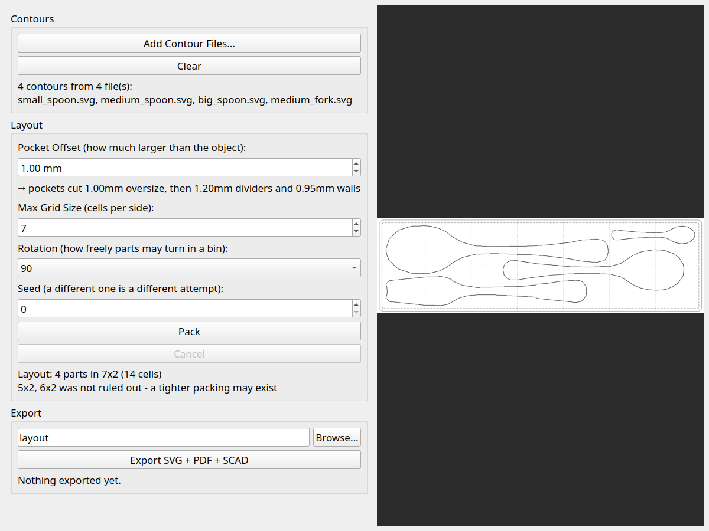
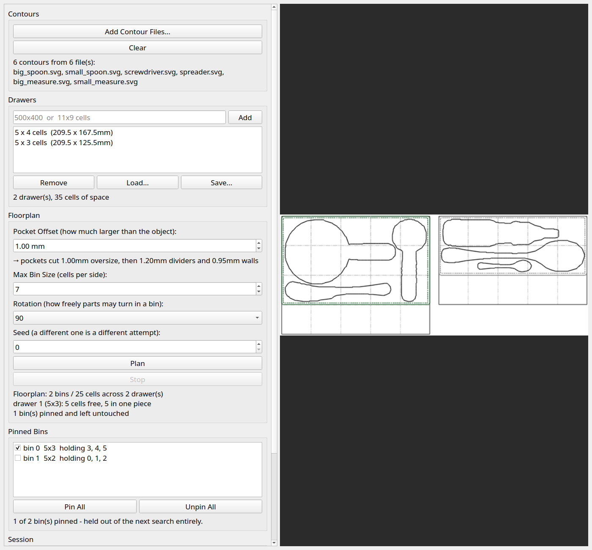
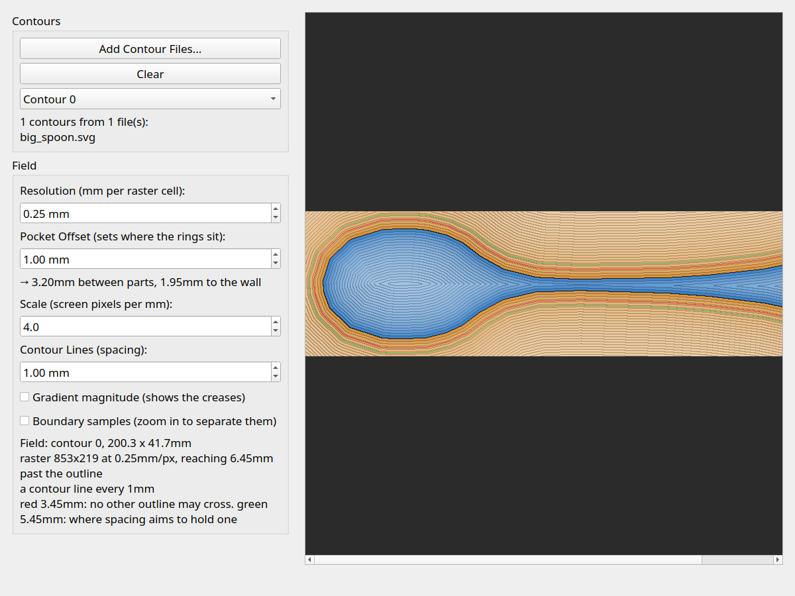
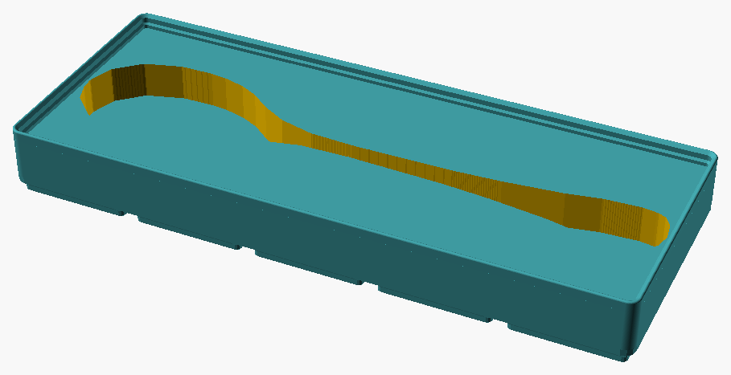

# Gridfinity Contours

**Photograph the things in your drawer. Get the [Gridfinity](https://gridfinity.xyz/)
bins that hold them.**



Not a bin that's roughly the right size — a bin cut to the actual outline
of each object, at true scale, with several objects packed into the
smallest bin that fits them, and every bin assigned to a drawer you
actually own.

Photo in, `.scad` out. There is no CAD in the middle.

## Why you might want this

- **It measures.** Put a printed calibration sheet in the frame and the
  contour comes out in millimetres, not pixels — corrected for however the
  camera happened to be held. The screwdriver below exports as a
  37 × 163 mm outline.
- **It packs.** Give it ten objects and it works out which of them should
  share a bin, how many bins that takes, and where each one sits — rather
  than making you print one bin per spoon.
- **It fits your drawers.** Type in the drawer sizes you have. It lays the
  bins out on the 42 mm Gridfinity lattice and prints you a floorplan to
  lay in the drawer.
- **It remembers what you already printed.** Pin the bins on your shelf and
  the next search leaves them alone, instead of proposing a marginally
  better arrangement of things you would have to reprint.
- **It admits when it doesn't know.** "Too small" and "not found" mean
  different things here, and the tools never say the first when they mean
  the second.

## Getting started

```
python3 -m venv .venv && source .venv/bin/activate
pip install -r requirements.txt
huggingface-cli download facebook/sam2-hiera-tiny
```

Then, in order:

**1. Print the calibration sheet** at 100% scale — "actual size", never
"fit to page".

```
.venv/bin/python3 generate_aruco_sheet.py
```

**2. Photograph an object** lying on the sheet, with all four markers in
frame.

**3. Trace it.** Left-click inside the object, right-click outside the object then,
press Export.

```
.venv/bin/python3 silhouette_gui.py photo.jpg
```

**4. Pack what you've traced** into bins, and the bins into your drawers.

```
.venv/bin/python3 floorplan_gui.py *.svg.json --drawer 500x400
```

**5. Print** the `.scad` each bin exports, and the floorplan PDF to lay
them out with.

## Watching it work

Capturing a screwdriver — photo in, real-world outline out:


Two clicks and one checkbox are the whole input. SAM2 segments from the
clicks, the four ArUco markers fix the scale, and what lands in the panel
is a contour in millimetres.

Four utensils looking for the smallest bin that holds them:


It fails at 5x2 and 6x2 before packing into 5x3.

Six objects deciding which of them should share a bin; then ten objects,
grouped into six bins, going into two drawers:


Six bins and 44 cells down to two and 25; then bins landing on whole 42 mm
cells, with the search taking one back out when a branch runs out.

Every picture in this repository is generated by a script and checked in —
including the recordings, which are grabs of the real windows rather than
mock-ups. [docs/media.md](docs/media.md) says which script makes which,
and why they are committed artifacts instead of test assertions.

## The tools

### `silhouette_gui.py` — trace one object

```
.venv/bin/python3 silhouette_gui.py [photo.jpg]
```

The capture window, animated above. Load a photo, click the object, and
it segments with SAM2, cleans up the mask, finds and simplifies the
contour, reads the ArUco sheet for scale, and exports the result as an SVG
for CAD, a same-scale PDF to print, and a JSON dump the layout tools read.

Each stage has its own group box in the panel, and everything downstream
of a change re-runs on the spot — so nudging the closing radius redraws
the outline without re-running the model.

If there is no calibration sheet in frame it falls back to pixel space
rather than failing. That is deliberate, and it is the one thing here that
can go wrong quietly: read the marker count in the panel.

**More:** [docs/capture.md](docs/capture.md) — what each stage does, why
the symmetry combine has two modes, and why the exported SVG's coordinates
are pre-scaled by 96/25.4.

### `layout_cli.py` — pack contours into one bin

```
.venv/bin/python3 layout_cli.py \
    test_data/small_spoon.svg test_data/medium_spoon.svg test_data/big_spoon.svg \
    --out spoons
```

```
loaded 3 contours from 3 file(s)
...
4x2 (8 cells): too small - part 1 is 164.8x37.0mm and does not fit a 162.3x78.3mm interior at any quarter turn
3x3 (9 cells): too small - part 1 is 164.8x37.0mm and does not fit a 120.3x120.3mm interior at any quarter turn
5x2 (10 cells): packed
packed 3 parts into 5x2 (10 cells)
wrote spoons.svg, spoons.pdf, spoons.scad
```

Finds the smallest Gridfinity bin the contours all fit in, and writes the
sheet to print, the PDF to check against the real objects, and the `.scad`
to slice — the bin at the top of this page.

Every rejected size is reported with *why*, and the two reasons are not
the same. **"Too small"** is a proof from areas and bounding boxes.
**"Not found"** means the solver did not manage a size the bounds allowed,
so that size may still be packable — raise `--restarts` and see. When that
happens below the size it settles on, a closing note says so, because then
the bin you print is bigger than it needed to be.

What actually gets packed is the **pocket** — the object grown by
`--pocket-offset` (1 mm by default), which is the hole that gets cut
rather than the thing that goes in it. That offset is not print tolerance
alone: it covers the camera's resolution, the printer's, the object
shifting between the two, and the slack a deep pocket needs before you
can lift the object back out of it. Sizes reported above are pockets, so
they run about 2 mm over what a tape measure says.

The printed sheet draws both, which is what makes it worth printing:
**solid is the pocket** that will be cut, **dashed is the object** it was
cut for. Lay the real tool on the dashed line to check the capture came
out right; the ring of white between the two lines is the offset, at true
scale, and it is the only place you can actually see it before it is
plastic.

Useful flags: `--restarts` and `--seed` steer the search, `--max-grid`
caps the bin size, `--pocket-offset` sets how much larger than its object
each pocket is cut, `--height` sets the depth in 7 mm units, `--no-scad`
skips the solid. Ctrl-C stops the search and still reports everything it
learned.

### `layout_gui.py` — the same, interactively

```
.venv/bin/python3 layout_gui.py test_data/*.svg
```



Accumulates contours from several capture sessions, packs them, and
previews the result. Separate from the capture window because that one
works on one photo and packing wants objects from many — the three spoon
fixtures are three different photographs. The file arguments are optional;
there is a Load button.

### `floorplan_gui.py` — your whole library, across your drawers

```
.venv/bin/python3 floorplan_gui.py test_data/*.svg --drawer 500x400
```



The top of the stack. `layout_gui.py` packs the objects you give it into
*a* bin; this one decides which objects should share a bin at all, how
many bins that takes, and which drawer each goes in — then draws the
floorplan you print and lay in the drawer.

- **Drawers are typed in either unit.** `500x400` is a measurement in mm,
  `11x9 cells` is already counted. Bare numbers mean millimetres, so cells
  have to be asked for.
- **The search takes minutes, and the window is built around that.** It
  runs on a worker thread, redraws four times a second, and can be
  stopped — stopping keeps the best grouping it had.
- **What it draws is always the drawers**, empty from the moment you add
  one, filling as the search works. Anything it is holding but has not
  placed is drawn beside them rather than dropped.
- **Export writes the map and every bin on it** — the floorplan PDF, then
  an SVG, PDF and `.scad` per bin. The solids are cut from the layouts the
  plan chose, so a bin matches the floorplan you printed to lay it out
  with.
- **Pin the bins you have already printed.** Tick them and they are held
  out of the next search entirely — the same bin object carried through,
  not an equally good rearrangement of it. Pinned bins are drawn with a
  heavy green outline, on screen and on the printed sheet.
- **Save the session and resume it** when the next tool arrives. Add the
  contour, press Plan, and the panel says which bins are unchanged and
  which have to come off the printer again.

**More:** [docs/layout.md](docs/layout.md).

### `field_gui.py` — look at what the packer sees

```
.venv/bin/python3 field_gui.py test_data/*.svg
```



Both phases of the layout search read one thing — the signed distance
field rasterized for each contour — and neither of them draws it. This
does: one contour at a time, contoured every millimetre, with the
clearance levels marked in red and green. Hover for the distance under the
pointer.

The **Gradient magnitude** checkbox shows where the field stops being a
distance — the creases of the medial axis, which is exactly where the
solver's forces stop being trustworthy. It packs nothing and writes
nothing; it is a magnifying glass, not a stage.

### `generate_aruco_sheet.py` — the calibration sheet

```
.venv/bin/python3 generate_aruco_sheet.py [output.pdf]
```


A letter-size PDF with four ArUco markers at known millimetre positions.
Print at 100% scale and keep it in frame — any scaling silently
invalidates every measurement downstream. Its defaults already match what
the calibration stage expects, so nothing needs configuring.

### `solid.py` — one contour, one bin



A bin with one cutout, which is the shape this writes: paste an exported
contour into the `points` array at the bottom and it produces the
Gridfinity `.scad`. Needs the `gridfinity-rebuilt-openscad` submodule and
OpenSCAD.

Kept for reference rather than for use. The picture above is actually the
*newer* generator given a single object, because the two differ in a way
worth knowing about: this one subtracts the pocket from outside the bin
and unions the base back on, which works but leaves the pocket depth
implicit — a bare `linear_extrude()` cuts 100 mm upward from z=0 and the
floor lands wherever the base happens to start.

**For anything with more than one object in it, use `layout_cli.py`** — it
takes a whole set of contours, states the depth, and writes the `.scad`
for you.

### `postprocess_gcode_for_prusa_i3.py` — two-tone prints

```
python3 postprocess_gcode_for_prusa_i3.py path/to/file.gcode [height_mm]
```

Inserts an `M600` colour-change pause into already-sliced gcode at a given
layer height. For "shadow" prints where the bottom of the pocket is a
different colour from the top, on printers without an AMS.

### The demo scripts

`capture_demo.py`, `layout_demo.py`, `screenshot_demo.py`,
`render_demo.py` and `solid_demo.py` write every picture on this page.
`make media` regenerates the lot; see [docs/media.md](docs/media.md) for
what each one costs and what it needs.

## Design docs

- [docs/architecture.md](docs/architecture.md) — the view from above: the
  four cardinality levels (photo, bin, bin set, drawer), where the
  parallelism is, and how the optimization loops nest. **Start here.**
- [docs/capture.md](docs/capture.md) — photo to contour: segmentation,
  mask cleanup and symmetry, ArUco calibration, and what the three
  exported files are each for.
- [docs/layout.md](docs/layout.md) — packing contours into the smallest
  practical number of cells via a repulsive-force relaxation, and grouping
  contours across bins.
  [docs/layout_roadmap.md](docs/layout_roadmap.md) is the implementation
  plan; built through M9.
- [docs/media.md](docs/media.md) — how every picture here is generated,
  and why they are committed artifacts rather than test assertions.

## Installation

1. Create and activate a virtual environment:
   ```
   python3 -m venv .venv
   source .venv/bin/activate
   ```
2. Install dependencies: `pip install -r requirements.txt`
3. For `solid.py` and the bin renders, fetch the OpenSCAD submodule:
   `git submodule update --init`
4. The SAM2 model (`facebook/sam2-hiera-tiny`) is loaded offline
   (`local_files_only=True`) by default, so it needs to be cached first —
   `huggingface-cli download facebook/sam2-hiera-tiny`. Alternatively,
   pass `--download-model` to `silhouette_gui.py` to let it fetch the
   model on first run.

## Development

Config for `black`/`pytest`/`pyright` lives in `pyproject.toml`; `mdformat`
reads only `.mdformat.toml`. A `Makefile` wraps all of them:

- `make check` — format, lint, typecheck and test, on four cores; every
  failure is reported, not just the first
- `make check-serial` — the same one at a time, when interleaved output is
  the problem
- `make format` / `format-check` / `lint` / `typecheck` / `test` —
  individually
- `make docs` — re-render `docs/*.dot` to SVG (needs graphviz);
  `make docs-check` fails if a rendered SVG is older than its source
- `make media` — regenerate every picture (see
  [docs/media.md](docs/media.md))
- `make requirements` — regenerate `requirements.txt` from
  `requirements.in`

`requirements.in` lists only direct dependencies; `requirements.txt` is
the fully-pinned `pip-compile` lockfile, annotated with `# via <package>`
showing why each transitive dependency is there. Install from the lockfile,
but edit `requirements.in` and run `make requirements` to change anything.
That needs `pip-tools`, which is a meta-tool for maintaining the lockfile
rather than a project dependency, so it is not in `requirements.in`.

Tests are plain `pytest`. The `slow` marker flags end-to-end work that
costs seconds to minutes — loading the real SAM2 weights, running the
layout search over real contours, or taking a picture of a window:

```
.venv/bin/python3 -m pytest              # everything
.venv/bin/python3 -m pytest -m "not slow"  # skip the slow ones
```
