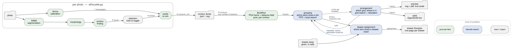
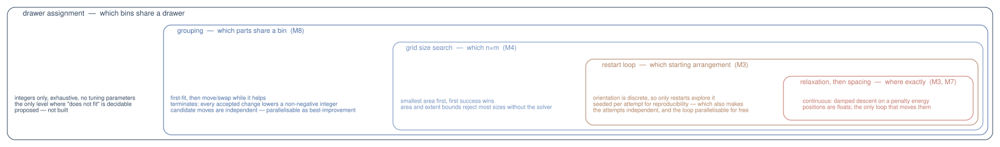

# Architecture: levels, cardinality, and where the loops nest

[capture.md](capture.md) and [layout.md](layout.md) each design one level
of this project in detail. This document is the view from above: what the
whole compute graph looks like, how many of each thing there are at each
step, which parts could run in parallel, and how the optimization loops
nest inside one another.

It exists because the interesting bugs and the interesting design
decisions both live at the *boundaries* between levels — where one photo
becomes many contours, where many contours become one bin, where many
bins become one drawer. Each boundary is a place where a type changes
shape, and every one of them has already caused a design correction.

## The four levels

| Level | What varies | Kind of problem | Built |
| --- | --- | --- | --- |
| Capture | which pixels are the object | per-photo functions | M0 |
| Arrangement | where each part sits in a bin | continuous, stochastic | M3–M7 |
| Grouping | which parts share a bin | discrete, heuristic | M8 |
| Drawer | which bins share a drawer | discrete, exact | M9 |

**The stack gets more discrete as it goes up, and exactly one level is
exact.** The arrangement solver moves floats and is stochastic, so a
failure there means "not found", never "impossible" — which is why
`PackResult` distinguishes the two and why `packer.ProvablyTooSmall`
exists at all. Grouping inherits that: it is a discrete search whose cost
function is a stochastic continuous one, so it inherits the uncertainty
along with the answer. The drawer level inherits none of it. Bins are
integer rectangles on an integer lattice, so an exhaustive search can
prove that a set of bins does not fit a drawer, as a fact rather than as
an observation about how hard it looked.

That asymmetry is worth stating because it decides what each level may
*conclude*. Only the drawer level can turn its own failure into an
instruction for the level below it.

## Cardinality, stage by stage

| Stage | In | Out |
| --- | --- | --- |
| Segmentation → morphology | 1 image | 1 mask |
| Contour finding | 1 mask | K contours |
| Selection | K contours | N picked, `N ≤ K` |
| ArUco calibration | 1 image | 1 homography |
| Rectify | 1 homography, N contours | N contours in mm |
| Export / dump | N contours | 1 svg + 1 pdf + 1 json |
| Load | F files | N contours, renumbered |
| `BuildPart` | 1 contour | 1 part |
| `Pack` | N parts | 1 layout |
| `Group` | N parts | M layouts |
| Preview, solid | 1 layout | 1 file |
| `Assign` | M bins, D drawers | placed bins, or infeasible |

**The capture session is one *photo*, not one object.** This is easy to
get backwards, and worth pinning down because a lot follows from it:
`ContourSelection.selected` is a `set`, and every selected contour is
simplified, rectified and exported together. So many objects in one frame
already works. What is singular is everything the frame shares — one
segmentation, one calibration, one homography.

Contours from different sessions compose because rectification puts them
all in real millimeters. That is the only reason a contour dump is a
useful artifact, and the reason `layout_gui` can accumulate parts across
files that have no other relationship to each other. The millimeter frame
is the project's universal currency; the JSON dump is where it is written
down.

## Where the boundaries actually bite

Three cardinality boundaries exist today. Two are settled and one is not.

**1 photo → N contours** is settled. The seam is `contour_io`, and it
holds because of the millimeter frame above.

**N contours → 1 bin** is settled. That is the whole of M3–M7.

**N parts → M bins** is built but *unplumbed*. `Group` returns a list of
layouts, and nothing downstream accepts one: `preview.LayoutShapes`,
`render.RenderLayout`, `solid.GenerateScad`, `LayoutStage`, `layout_cli`
and `layout_gui` all take a single `Layout` and write a single set of
files. M8 left this as an explicit unchecked box rather than
half-answering it.

The drawer level adds a fourth, **M bins → D drawers**, and it lands
directly on top of the unfinished third one.

### The consequence for build order

Plumbing multi-bin output through the front ends *now* means doing it
twice. The output currency today is one `Layout`. After grouping it
becomes a list of layouts. After drawer assignment it becomes a list of
layouts *with a drawer and a cell position each* — a different type again,
and the one that the preview actually wants, because a drawer
floorplan is the thing you print and lay in the drawer.

So the recommended order is: build the drawer level headless first, on
top of `Grouping` as it already exists, and then plumb the front ends once
against the final shape. The drawer level needs nothing from the GUI to be
testable — it consumes integer footprints and drawer sizes, and its
correctness is entirely a matter of whether rectangles tile.

## Where the parallelism is

Nothing here is parallelised today. Recording where it could be, in
descending order of how much it would buy:

**`BuildPart`, per contour.** A pure function of one contour, called in a
dict comprehension in `loading.BuildParts`. This is the one that scales
with the size of a person's actual library — rasterizing a signed distance
field is the single most expensive per-object step, and forty objects is
forty independent rasterizations.

**The restart loop, per attempt.** Already independent, and already paid
for: `SolveFixedGrid` seeds each attempt as
`np.random.default_rng([params.seed, attempt])` so that an attempt
reproduces on its own and raising the restart budget does not renumber the
attempts before it. That was done for reproducibility, but it also makes
each attempt a pure function of `(parts, grid, params, attempt)`. Running
them in parallel and keeping the lowest-index success gives **identical
results** to running them in order, at the cost of the attempts a serial
run would have skipped after the first success.

**Grouping's candidate moves.** Each candidate is independent to price.
The obstacle is not the moves, it is that the search takes the *first*
improvement, which is sequential by construction. Best-improvement
parallelises perfectly and costs more solver calls per pass; whether that
trade pays depends on core count, and it is a real choice rather than an
oversight.

This is now the level that actually needs it. Measured on the eighteen
`test_data/` objects, first-fit alone takes ~52 s while the local search
on top of it did not finish in ten minutes — the search is quadratic in
bins and every surviving candidate is a full stochastic solve of a set the
cache has never seen. Parallel best-improvement is the obvious lever, and
the one place in this project where parallelism would change what is
possible rather than merely what is fast.

**Drawer assignment.** Independent subtrees, once the placement order is
canonical.

The grid size search is deliberately *not* on this list. Candidates are
tried smallest-area-first and the first success wins, so speculating on
larger sizes is work thrown away in exactly the common case where the
small one fits.

## The drawer level

Given a set of drawers, each an integer `W × H` of grid
cells, and the bins grouping produced, each an integer `n × m` footprint:
find an assignment of bins to drawers and positions within them such that
no two bins overlap and every bin is inside its drawer. Or report that no
such assignment exists.

**It has no continuous parameters, and no clearances.** This is not a
simplification, it is a property of the Gridfinity spec:
`OuterFootprint` is `42·n − 0.5`, and that half-millimeter gap — the one
that keeps neighbouring bins from binding — is already *inside* each
bin's footprint. Bins therefore abut exactly on the 42 mm lattice, and
two adjacent bins need nothing between them. Every quantity at this level
is an integer count of cells. There is nothing to tune, nothing to
measure against a physical print, and no raster error to leave margin for.

That is why this level can be exact where the ones below it cannot.

**Rotation stays free, but a bin has fewer distinct turns than a part.** A
part is asymmetric, so all four quarter turns place it differently and the
solver tries all four. A bin's *footprint* is a rectangle, so 0° and 180°
occupy identical cells, as do 90° and 270° — only two distinct footprints
exist, and the assignment search enumerates exactly those (one, for a
square bin). That is completeness, not a shortcut: no feasible assignment
can be lost, because the pair it skips covers the same cells.

What it does mean is that the search picks a *footprint*, not a physical
orientation. Two ways of seating a bin in the cells it was given are
equally valid, and the floorplan draws one of them — so it shows a
placement that works, not the only one. Nothing downstream depends on
which, since a Gridfinity bin's exterior is symmetric under that turn.

`packer.CandidateGrids` emits only `n ≥ m` on the same reasoning, and the
argument survives one level up unchanged.

**Feasibility first, and contiguity reported rather than optimized.** The
primary question is whether the bins fit at all. Leftover room matters
too — the next object photographed has to go somewhere, and a drawer with
six scattered single cells free has room for nothing — but making
contiguity an *objective* would mean enumerating every complete
assignment instead of stopping at the first, and that early exit is what
the search's speed rests on.

Bottom-left stability turns out to give most of the benefit for free,
though **not all of it**, which an earlier draft of this section got
wrong. Measured on a realistic drawer, 143 of the 144 free cells came out
connected and one was stranded behind a 1×1 bin. So `FreeCells` counts
what is left and `LargestFreeRegion` says how much of it is in one piece;
the gap between the two is precisely the space that is free and useless.

### Sketch

Occupancy is one integer per drawer: a row-major bitmask, one bit per
cell. "Does this bin fit at this position" becomes a shift and an AND,
and "place it" becomes an OR. Python's integers are arbitrary precision,
so this holds at any drawer size — a 500 × 750 mm drawer is 11 × 17 cells,
comfortably past a machine word and still a single value.

The search needs the two disciplines this project already applies one
level down:

- **A canonical placement rule.** Without one the search re-derives every
  permutation of the same packing, and the branching factor is the whole
  drawer. The rule is **bottom-left stability**: a bin goes only where it
  cannot slide one cell further left or down. This is complete, because
  pushing rectangles left and down terminates and never creates an
  overlap, so every packing normalizes into one made of stable positions.

  Not "some bin must cover the lowest-index free cell", which is the rule
  for *exact cover* and is unsound here — a drawer is allowed to have
  empty cells, and demanding they be filled would reject every assignment
  that leaves room for the next object.

- **A one-sided bound in front of the solver.** Total bin cells against
  total drawer cells. Same shape as M4's area bound and M8's, and the same
  requirement: it must never reject an assignment that would have worked,
  because an over-eager bound at this level silently reports "buy another
  drawer".

### What it changes below itself

One thing, and it is small. Grouping currently caps bin size with a scalar
`max_grid`, and `CandidateGrids` enumerates every `n ≥ m` up to it. A
drawer-aware grouping needs a *set* of admissible footprints instead — a
bin 7 cells long cannot go in a drawer 6 cells wide at any angle, however
few cells it uses. That is a predicate on `CandidateGrids` and nothing
more; the bound, the cache key and the search are all unaffected.

This is the feedback edge on the compute graph, and the reason the drawer
level is drawn *outside* grouping in the loop hierarchy despite coming
after it in data flow. When assignment fails, it knows which footprints
caused the failure, and re-running grouping with those excluded is a
different question rather than a retry of the same one.
