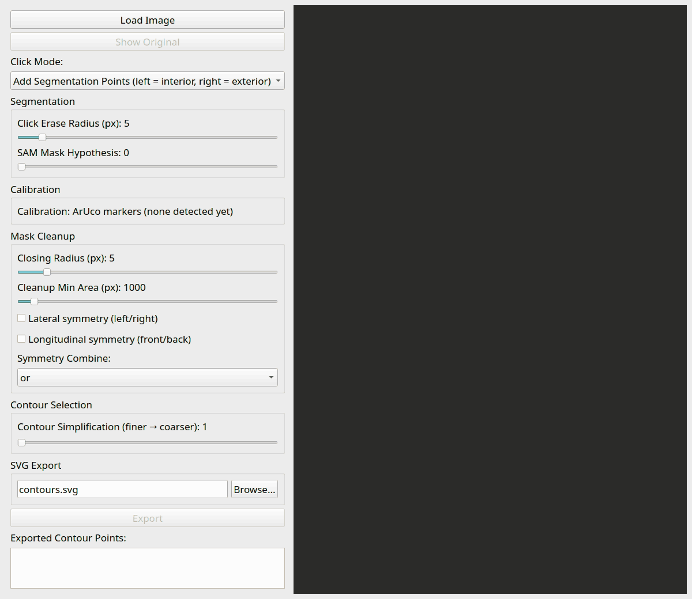
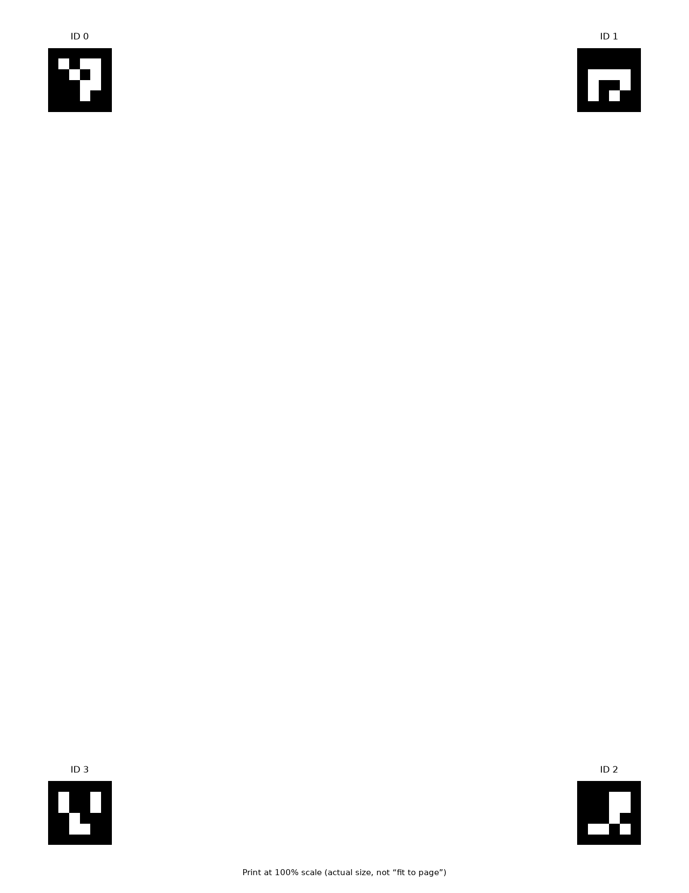

# Capture: photo to real-world contour

How `silhouette_gui.py` turns a photograph into an outline in millimetres,
and why each step is there. This is the bottom level of the four in
[architecture.md](architecture.md) — everything above it consumes what
this produces.

The window is a chain of `pipeline.core.Stage` objects, each owning its
own parameters, its own group box in the control panel, and its own debug
image. `Pipeline` wires them together and re-runs everything downstream of
whatever changed, which is why nudging the closing radius redraws the
contour without re-running SAM2.

## The stages

**1. Load.** Any image OpenCV can read. Nothing about the pipeline assumes
a resolution.

**2. Segment.** Left-click adds an interior point, right-click an exterior
one, and both go to SAM2 (`facebook/sam2-hiera-tiny`) as prompts. Only the
connected components a positive click actually landed on are kept, so a
stray blob elsewhere in the frame cannot leak into the result.

The exterior point matters more than it sounds. A soft drop shadow on
white paper is the thing SAM2 most reliably swallows, because its edge
looks like the object's edge at every scale. On the screwdriver fixture,
one right-click on the shadow takes 31 000 pixels off the mask and half a
millimetre off the tool's length.

**3. Clean up** (`pipeline/morphology.py`). Morphological closing to
smooth jitter, a minimum-area filter to drop noise blobs, then optional
symmetry.

Symmetry is worth explaining, because it is the one step that adds
information rather than removing it. Most manufactured objects are
symmetric about at least one axis and the lighting never is, so the shaded
side segments a little thin. The mask is mirrored about its PCA-aligned
bounding box — laterally, longitudinally, or both — and combined with the
original:

| Combine | Effect | Use when |
| --- | --- | --- |
| `or` (default) | takes the wider of the two at every point | a side is occluded, shadowed, or under-segmented |
| `and` | takes the narrower | a one-sided error *added* area that is not object |

On the screwdriver fixture, lateral `or` puts back 11 900 pixels the
shaded side lost and drops the simplified outline from 73 points to 67, as
one-sided jitter stops being a feature worth tracing. `and` on the same
mask takes the length from 162.48 mm to 162.36 mm.

**4. Extract and simplify** (`pipeline/contour_extraction.py`). Contours
of the cleaned mask, each simplified, each with a PCA-aligned bounding box
— which is what later lets a contour be exported level rather than at
whatever angle it happened to be photographed.

**5. Calibrate** (`pipeline/calibration.py`). `ArucoCalibration` detects
the four markers on the printed sheet, matches them to their known mm
positions, and solves for the homography. **If no markers are found it
falls back to pixel space rather than failing** — which is deliberate, and
is also the one silent failure in the whole tool: the window still looks
like it worked, and everything downstream is in pixels. The status line
says how many markers matched; that is the thing to read.

**6. Select.** Clicking a contour selects it, and selection rectifies it
through the homography immediately — the text preview is live, with no
button to press. Selection is a *set*: many objects in one frame is one
session, not several.

**7. Export.** Three files, from one button:

- `NAME.svg` — one closed polygon per contour, PCA-aligned so it comes out
  level, for import into CAD.
- `NAME.svg.pdf` — the same drawing at the same scale, to print.
- `NAME.svg.json` — the contour dump, which is what the layout tools read.

### Why three files and not one

The **SVG** carries true millimetres in `width`/`height`, but its viewBox
and path coordinates are pre-scaled by 96/25.4. That looks wrong and is
not: several importers, Fusion 360 among them, ignore the physical-unit
suffix on `width`/`height` and treat raw SVG coordinates as CSS 96 dpi
pixels. Without the pre-scaling the imported sketch arrives 3.78× too
small. See `_SVG_USER_UNITS_PER_MM` in `export/svg_writer.py`.

The **PDF** exists because not every SVG viewer or print path honours
embedded physical units either, and a PDF's page size is unambiguous. If a
printed SVG comes out the wrong size, print this instead.

The **JSON dump** exists because the SVG is a *picture* of the contours
rather than the contours: it aligns each one into its own frame and rounds
to four decimals for drawing. The dump is what `layout_cli.py` and the
layout windows read, and exporting it from the same button is what makes
packing possible without re-clicking a photo every time.

## Click modes

A click alone cannot say whether it means "segment this" or "select that",
so one mode is active at a time, from the *Click Mode* dropdown:

- **Add Segmentation Points** (default) — left/right adds an
  interior/exterior point for SAM2.
- **Select a Contour** — click a detected object to select or deselect it.
- **Select a Fiducial** — toggle a calibration fiducial by hand, for
  calibration strategies that support it. Not the default ArUco one, which
  matches markers by ID.

## Annotations are sized in screen pixels

Everything the window draws over the photo — click crosses, contour
outlines, the PCA box — is drawn into the *full-resolution* image and only
scaled to fit afterwards. A mark sized in image pixels therefore has no
fixed size on screen. The click marker used to be one eightieth of the
photo's short side, which on a 5184 px photograph is 43 px, and lands on
**four screen pixels** once that photo is displayed in a window.

`click_recorder.ImagePixelsPerScreenPixel` converts at draw time from the
same widget-to-image mapping that turns a click back into a pixel, so the
two cannot disagree. A mark is the same size on screen whatever was
photographed and however big the window is.

## The calibration sheet

`generate_aruco_sheet.py` writes the letter-size sheet, with four
`DICT_4X4_50` markers inset far enough from the edges to survive typical
printer margins. Its defaults already match `ArucoParameters`, so nothing
needs configuring unless you change the constants in one of them.

**Print it at 100% scale** — "actual size", never "fit to page". Any
scaling silently invalidates every millimetre the tool reports, because
the marker positions it solves against are the ones written on the sheet.
